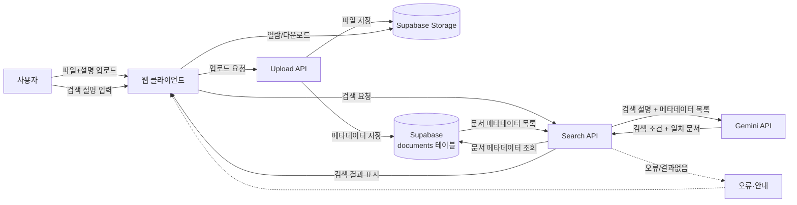

# 프로젝트 기준선

## 문서 정보

- 프로젝트명: javis
- 문서 버전: v0.4
- 작성일: 2026-08-06
- 현재 상태: WBS·마일스톤까지 확정 (이전 기획 `jarvis-personal-ai-os`를 2일 규모로 축소, v0.1의 "기억 기반 대화" 방향에서 "문서 검색·전달"로 전환)

## 프로젝트 한 문장

여러 문서(자료, 노트, PDF 등)를 만들어 보관하는 나(개발자)가
나중에 필요할 때 그 문서를 어디에 저장했는지 기억나지 않아 폴더를 하나씩 뒤져야 하는 문제를
찾고 싶은 문서를 자연어로 설명하면 AI가 저장된 문서 중에서 찾아 열람·다운로드 링크로 보여주는 방식으로 줄여
휴대폰에서도 그 링크로 바로 문서를 확인할 수 있는 것을 확인할 수 있게 만듭니다.

## 1. 프로젝트 목적

이전 기획(`jarvis-personal-ai-os`)의 "사용자를 대신해 실제로 도움이 되는 일을 처리하는 AI"라는 방향은 유지하되, 도구 제어·안전 승인 같은 큰 구조 대신 "내가 저장해둔 문서를 자연어로 찾아준다"는 구체적이고 검증 가능한 업무 하나로 좁힌다. 검색 결과는 휴대폰에서도 바로 열어보거나 받을 수 있어야 한다.

## 2. 문제 정의

- 사용자: 나(개발자) 자신 — 여러 문서/자료를 만들고 보관하는 1인 사용자
- 사용 상황: 예전에 만들어 둔 문서가 나중에 다시 필요할 때, 파일명이나 저장 위치를 정확히 기억하지 못함
- 문제: 폴더와 파일명을 하나씩 뒤져야 해서 시간이 걸리고, 특히 휴대폰에서는 더 찾기 어려움
- 기대 변화: "그때 쓴 ~ 관련 문서" 처럼 자연어로 설명하면 AI가 후보를 찾아주고, 휴대폰에서도 바로 열람·다운로드할 수 있음

## 3. 프로젝트 범위 초안

### 이번 프로젝트에서 다룰 내용
- 문서 업로드 화면: 파일을 올리면 Supabase Storage에 저장하고, 파일명·설명·업로드일 등 메타데이터를 documents 테이블에 저장
- 검색 화면 (홈): 찾고 싶은 문서를 자연어로 설명 입력 → Gemini가 이를 검색 키워드/조건으로 변환 → 저장된 문서 메타데이터 중 일치하는 항목을 찾아 결과로 표시
- 검색 결과 화면: 찾은 문서 목록과 각 문서의 열람·다운로드 링크 제공 (휴대폰 브라우저에서도 동일하게 열림/다운로드됨)

### 이번 프로젝트에서 다루지 않을 내용 (원래 기획·초기 방향에서 제외)
- 이메일·문자·카카오톡 등으로 실제 "전송"하는 기능 — 웹 링크로 열람/다운로드하는 방식으로 대체. 전송 연동을 붙이면 별도 API/인증까지 늘어나 이틀 목표를 넘어서기 때문
- 문서 본문에 대한 OCR·전문 검색 — 제목·설명 등 메타데이터 기반 검색만 지원. 문서 내용 전체 검색(임베딩 등)은 정확도 튜닝에 시간이 걸려 다음 버전으로 미룸
- 문서 변환/포맷 변경 기능 (특히 HWP → PDF 변환) — LibreOffice 같은 변환기가 필요한데 Vercel 서버리스 환경(읽기 전용 파일시스템, 실행시간 제한)에서는 실행할 수 없고, 유료 외부 변환 API를 붙이면 API 키·비용·요청 제한 관리까지 늘어나 이틀 목표를 넘어섬. 원본 파일 그대로 열람/다운로드만 제공
- 로그인/멀티유저, 다른 사람과의 공유
- 대용량 파일 지원 — Supabase Free 플랜의 File Storage가 1GB로 제한되어 있어(2026-08-06 확인), 개인용 소규모 문서 위주로 범위를 한정
- 실제 도구 제어(파일 삭제/이동 등 실행), 위험 승인 플로우, 음성 인터페이스, 선제적 알림, 감사 로그 시스템 — v0.1과 동일한 이유로 계속 제외

**줄인 이유:** "찾아서 보여주고 휴대폰에서 열 수 있게 한다"까지만 확실히 만들고, 실제 전송·본문 전문 검색·문서 변환처럼 범위를 넓히는 기능은 검증 가능한 핵심(자연어 → 검색 → 결과 확인)이 완성된 뒤 다음 버전에서 확장한다.

**향후 검토:** HWP → PDF 변환이 꼭 필요해지면, Vercel 서버리스가 아닌 별도 서버(LibreOffice 상주)나 유료 변환 API(CloudConvert 등) 연동을 다음 버전 범위로 검토한다.

## 4. 확인한 사실

- 이전 세션에서 작성한 `jarvis-personal-ai-os` 기획(SPEC.md, README.md)이 이미 존재하며, 이번 프로젝트는 그 축소판임
- 기술 스택은 Next.js / Vercel / Supabase / Gemini API로 고정
- Supabase Free 플랜 저장 용량: Database 500MB, File Storage 1GB (2026-08-06, supabase.com/pricing 확인)

## 5. 아직 확인하지 않은 가정

- Gemini가 자연어로 표현된 검색 설명("그때 발표할 때 썼던 자료")을 실제 저장된 문서의 파일명/설명과 잘 매칭할 것이다 — 검증 방법: 다양한 표현으로 검색해 실제 원하는 문서가 상위에 나오는지 확인
- 메타데이터(파일명, 설명)만으로도 충분히 원하는 문서를 찾을 수 있을 것이다 — 검증 방법: 실제 문서 여러 개를 업로드하고 검색 정확도를 확인, 부족하면 본문 검색 필요성 재검토

## 6. 도메인 정의

사용자가 올려둔 문서를 저장해두고,
자연어로 찾는 문서를 설명하면 AI가 검색 조건으로 바꿔 일치하는 문서를 찾아
휴대폰을 포함한 어디서든 열람·다운로드할 수 있게 전달하는
개인 문서 검색 업무입니다.

### 도메인 요소

| 구분 | 도메인 요소 |
|---|---|
| 사람·역할 | 사용자 (1인) |
| 핵심 대상 | 문서(document), 검색 질의(query), 검색 결과(search_result) |
| 행동 | 문서 업로드, 문서 검색, 검색 결과 확인, 문서 열람/다운로드, 문서 삭제 |
| 규칙 | 검색은 문서의 파일명·설명 메타데이터를 기준으로 판단한다 / 삭제된 문서는 검색 결과에 나타나지 않는다 |
| 상태 | 업로드됨, 검색 중, 검색 완료, 삭제됨 |
| 이벤트 | 문서업로드됨, 검색요청됨, 검색결과생성됨, 문서열람됨, 문서삭제됨 |

**헷갈리기 쉬운 부분:** "검색"은 사용자의 행동(자연어 입력)이면서 동시에 AI가 수행하는 처리(키워드 변환 + 매칭)를 가리킵니다. 이 문서에서 "검색"은 기본적으로 **AI가 자연어 질의를 검색 조건으로 바꿔 문서를 찾는 처리 과정 전체**를 뜻합니다.

## 7. 사용자 역할

| 역할 | 책임 | 주요 행동 | 필요한 화면 | 접근 데이터 |
|---|---|---|---|---|
| 사용자 | 문서를 올리고, 필요할 때 찾아서 확인 | 문서 업로드, 자연어 검색, 결과 확인, 문서 열람/다운로드, 삭제 | 업로드, 검색(홈), 검색 결과 | 자신이 올린 문서 전체 |

## 8. 업무 흐름

### 정상 업무 흐름

1. 사용자가 업로드 화면에서 문서를 올리고 간단한 설명을 입력합니다.
2. 시스템이 파일을 Supabase Storage에 저장하고, 메타데이터를 documents 테이블에 저장합니다.
3. 사용자가 검색 화면에서 찾고 싶은 문서를 자연어로 설명합니다.
4. Gemini가 설명을 검색 키워드/조건으로 변환합니다.
5. 시스템이 저장된 문서 메타데이터 중 조건에 맞는 문서를 찾아 결과로 보여줍니다.
6. 사용자가 결과에서 문서를 선택해 열람하거나 다운로드합니다 (휴대폰에서도 동일).

### 예외 업무 흐름

**검색 결과 없음**
1. Gemini가 검색 조건을 만들었지만 일치하는 문서가 없습니다.
2. 화면에 "일치하는 문서가 없습니다"를 안내하고, 검색어를 바꿔보도록 제안합니다.

**AI 처리 실패**
1. Gemini API 호출이 실패하거나 시간이 초과됩니다.
2. 화면에 오류 안내를 표시합니다.
3. 기존에 저장된 문서는 영향을 받지 않습니다.

**빈 입력/업로드 실패**
1. 사용자가 검색어 없이 검색을 시도하거나, 파일 없이 업로드를 시도합니다.
2. API를 호출하지 않고 입력을 요청하는 안내를 표시합니다.

## 9. 데이터 흐름과 아키텍처

**기능 한 문장:** 사용자가 찾는 문서를 자연어로 설명하면, AI가 이를 검색 조건으로 바꿔 저장된 문서 중 일치하는 것을 찾아 보여줍니다.

| 항목 | 내용 |
|---|---|
| 입력 데이터 | 검색 설명 텍스트 (검색 시), 파일 + 설명 텍스트 (업로드 시) |
| AI가 참고하는 데이터 | 검색 설명 텍스트, 저장된 문서들의 파일명·설명 메타데이터 |
| AI 판단 기준 | 검색 설명에서 핵심 키워드/조건 추출, 문서 메타데이터와의 관련도 판단 |
| 출력 데이터 | 일치하는 문서 목록 (파일명, 설명, 열람/다운로드 링크) |
| 저장할 데이터 | 문서(documents: 파일명, storage 경로, 설명, 업로드일), 검색 기록(질의, 결과 수, 검색일시) |
| 오류 흐름 | 검색 결과 없음, 빈 입력, AI 응답 없음/실패, 업로드 실패 |

### 구성요소

| 구성요소 | 역할 | 입력받는 정보 | 만들어 내는 결과 |
|---|---|---|---|
| 사용자 | 문서를 올리고, 자연어로 검색해 결과를 확인 | 검색 결과, 문서 링크 | 업로드 파일+설명, 검색 설명 |
| 웹 클라이언트 (업로드/검색/결과 화면) | 입력을 받고 결과를 화면에 표시, 휴대폰 브라우저에서도 동일하게 동작 | 검색 설명, 결과 목록 | API 호출 요청 |
| Upload API | 업로드된 파일을 Storage에 저장하고 메타데이터를 기록 | 파일, 설명 | 저장된 문서 레코드 |
| Search API | 클라이언트와 AI를 연결, 메타데이터 조회 요청 | 검색 설명 텍스트 | 검색 결과 목록 |
| Gemini API | 자연어 검색 설명을 검색 조건으로 변환 | 검색 설명, 문서 메타데이터 목록 | 검색 조건, 일치 문서 순위 |
| Supabase Storage | 실제 파일 저장, 열람/다운로드 링크 제공 | 파일 | 파일 URL |
| Supabase (documents 테이블) | 문서 메타데이터 저장·조회 | 파일명, 설명, storage 경로 | 문서 메타데이터 목록 |

### Mermaid 데이터 흐름도



## 10. 데이터 구조 초안

### 10.1 문서 업로드 입력 데이터

| 데이터 항목 | 설명 | 필수 여부 |
|---|---|---|
| `file` | 업로드할 파일 | 필수 |
| `description` | 문서에 대한 설명 (검색에 쓰일 근거) | 선택 |

### 10.2 문서(documents) 데이터

| 데이터 항목 | 설명 | 필수 여부 |
|---|---|---|
| `document_id` | 문서 고유 번호 | 필수 |
| `file_name` | 원본 파일명 | 필수 |
| `storage_path` | Supabase Storage 내 저장 경로 | 필수 |
| `description` | 문서 설명 | 선택 |
| `file_size` | 파일 크기(바이트) | 선택 |
| `uploaded_at` | 업로드 일시 | 필수 |

### 10.3 검색 질의·결과 데이터

| 데이터 항목 | 설명 | 필수 여부 |
|---|---|---|
| `search_id` | 검색 고유 번호 | 필수 |
| `query_text` | 사용자가 입력한 자연어 검색 설명 | 필수 |
| `matched_document_ids` | 검색된 문서 id 목록 | 선택 (결과 없음이면 빈 배열) |
| `result_count` | 검색 결과 수 | 필수 |
| `searched_at` | 검색 일시 | 필수 |

## 11. 데이터 소스

| 데이터 | 처음 발생하는 곳 | 사용하는 이유 |
|---|---|---|
| 업로드 파일, 설명 | 업로드 화면 | 문서 저장 및 검색 대상 등록 |
| 검색 설명 | 검색 화면 | 검색 조건 생성 |
| 검색 조건, 일치 문서 순위 | Gemini (검색 처리) | 검색 결과 판단 |
| 파일 URL | Supabase Storage | 열람·다운로드 제공 |

## 12. 이벤트 카탈로그

| 이벤트 | 발생 조건 | 상태 변화 | 다음 처리 |
|---|---|---|---|
| `document_uploaded` | 파일 업로드가 완료됨 | 없음 → 업로드됨 | 검색 대상에 포함 |
| `document_deleted` | 사용자가 문서 삭제를 요청함 | 업로드됨 → 삭제됨 | 검색 결과에서 제외 |
| `search_requested` | 사용자가 검색 설명을 제출함 | 없음 → 검색 중 | Gemini 검색 조건 생성 요청 |
| `search_completed` | 검색 결과가 생성됨 | 검색 중 → 검색 완료 | 결과 화면 표시 |
| `search_failed` | 검색 처리 중 오류 발생 | 검색 중 → 검색 실패 | 오류 안내 |

## 13. 용어와 네이밍 컨벤션

| 한글 공식 용어 | 영문 기준 이름 | 고유 번호 |
|---|---|---|
| 문서 | `document` | `document_id` |
| 검색 | `search` | `search_id` |

- 고유 번호는 이름 뒤에 `_id`를 붙입니다.
- 여러 영문 단어는 `snake_case`로 작성합니다.
- 이벤트는 이미 발생한 사건을 과거형으로 작성합니다 (`document_uploaded`, `search_completed`).
- 같은 대상은 문서·데이터·이벤트에서 같은 뿌리 단어(`document`, `search`)를 사용합니다.

## 14. MVP 범위와 기능 우선순위 (MoSCoW)

| 기능 | 우선순위 | 선택 이유 |
|---|---|---|
| 문서 업로드 | Must | 검색할 대상 문서가 없으면 아무것도 동작하지 않음 |
| 설명 입력 | Must | 메타데이터 기반 검색의 유일한 근거 |
| 자연어 검색 | Must | 프로젝트의 핵심 AI 기능 |
| 검색 결과 목록 표시 | Must | 사용자가 결과를 확인해야 함 |
| 열람·다운로드 링크 | Must | 실제로 문서를 받아야 목적이 달성됨 |
| 검색 결과 없음 안내 | Must | 빈 결과에서도 화면이 깨지지 않아야 함 |
| 검색 기록 저장 | Should | 있으면 좋지만 핵심 검증에는 필수는 아님 |
| 문서 삭제 | Should | 편의 기능, 없어도 핵심 흐름에는 영향 없음 |
| 문서 본문 전문 검색(OCR) | Won't now | 범위가 커지고 정확도 튜닝에 시간이 필요함 |
| 이메일·문자 전송 | Won't now | 외부 연동이 늘어나 이틀 목표를 초과함 |
| 로그인/멀티유저 | Won't now | 1인 사용을 전제로 하므로 불필요 |

## 15. 완료 기준 (Definition of Done)

| 기능 | 완료 기준 |
|---|---|
| 문서 업로드 | 파일과 설명(선택)을 입력하고 업로드하면 `documents` 테이블에 레코드가 생성되고 Storage에 파일이 저장됩니다. |
| 자연어 검색 | 검색창에 찾는 문서를 설명하고 검색을 실행하면, 관련도 높은 문서가 있을 경우 1개 이상 목록으로 표시됩니다. |
| 검색 결과 없음 | 조건에 맞는 문서가 없으면 "일치하는 문서가 없습니다" 안내가 표시됩니다. |
| 문서 열람·다운로드 | 검색 결과에서 문서를 선택하면 데스크톱과 휴대폰 브라우저 모두에서 파일이 열리거나 다운로드됩니다. |
| 빈 입력 처리 | 검색어 없이 검색하거나 파일 없이 업로드를 시도하면 API를 호출하지 않고 입력을 요청하는 안내가 표시됩니다. |
| AI 실패 처리 | Gemini 호출이 실패하거나 시간이 초과되면 화면이 깨지지 않고 오류 안내가 표시됩니다. |

## 16. 완료 체크리스트

### 프로젝트 목적과 범위
- [ ] 핵심 사용자와 해결하려는 문제가 작성되어 있습니다.
- [ ] 이번 프로젝트에서 만들 기능과 만들지 않을 기능이 구분되어 있습니다.
- [ ] MVP(Must) 기능과 이후 기능(Should/Won't now)이 구분되어 있습니다.

### 업로드·검색 기능
- [ ] 파일과 설명을 입력해 문서를 업로드할 수 있습니다.
- [ ] 자연어로 검색하면 관련 문서가 목록으로 표시됩니다.
- [ ] 일치하는 문서가 없을 때 안내가 표시됩니다.
- [ ] 검색 결과에서 문서를 열람·다운로드할 수 있습니다.
- [ ] 휴대폰 브라우저에서도 동일하게 동작합니다.
- [ ] 검색어/파일이 비어 있을 때 화면이 깨지지 않습니다.
- [ ] AI 호출이 실패해도 화면이 깨지지 않습니다.

### 문서
- [ ] 도메인 요소와 사용자 역할이 작성되어 있습니다.
- [ ] 정상 흐름과 예외 흐름이 작성되어 있습니다.
- [ ] 데이터 구조, 데이터 소스, 이벤트 카탈로그, 네이밍 규칙이 작성되어 있습니다.
- [ ] 데이터 흐름도와 아키텍처가 작성되어 있습니다.
- [ ] MVP 범위와 완료 기준이 작성되어 있습니다.

## 17. WBS (작업 분해)

6주가 아니라 **2일** 규모로 조정합니다. 담당자는 1인 개발이라 모두 "본인"입니다.

| WBS ID | 결과물·작업 | 담당자 | 예상 시간 | 선행 작업 | 완료 조건 |
|---|---|---|---:|---|---|
| 1.1 | Next.js 프로젝트 세팅 + Supabase 연결 | 본인 | 1시간 | 없음 | 로컬에서 Supabase 연결이 확인됩니다. |
| 1.2 | `documents` 테이블 + Storage 버킷 생성 | 본인 | 1시간 | 1.1 | 파일을 올리면 테이블에 레코드가 생성됩니다. |
| 1.3 | 업로드 화면 + Upload API 구현 | 본인 | 2시간 | 1.2 | 파일과 설명을 업로드하면 Storage·DB에 저장됩니다. |
| 1.4 | 검색 화면 UI(입력창, 결과 목록) 뼈대 작성 | 본인 | 1.5시간 | 1.1 | 정적 화면이 렌더링됩니다. |
| 2.1 | Gemini 연동: 검색 조건 변환 프롬프트 작성 | 본인 | 2시간 | 1.2 | 자연어 입력을 넣으면 검색 키워드/조건이 반환됩니다. |
| 2.2 | Search API 구현 (Gemini 결과로 documents 매칭) | 본인 | 2시간 | 2.1, 1.3 | 검색 요청 시 관련 문서 목록이 반환됩니다. |
| 2.3 | 검색 결과 화면 연결 + 열람·다운로드 링크 | 본인 | 1.5시간 | 2.2 | 결과를 클릭하면 파일이 열리거나 다운로드됩니다. |
| 2.4 | 예외 처리 (빈 입력, 결과 없음, AI 실패) | 본인 | 1시간 | 2.3 | 어떤 경우에도 화면이 깨지지 않고 안내가 표시됩니다. |
| 2.5 | 모바일 반응형 확인 + Vercel 배포 | 본인 | 1시간 | 2.4 | 시크릿 창·휴대폰에서 정상 동작이 확인됩니다. |
| 2.6 | 문서화(README, 스크린샷) + 최종 점검 | 본인 | 1시간 | 2.5 | 제출 체크리스트를 통과합니다. |

### 선행 작업 관계

```text
프로젝트 세팅
→ documents 테이블/Storage
→ 업로드 화면·API
→ Gemini 검색 조건 변환
→ Search API
→ 검색 결과·다운로드 화면
→ 예외 처리
→ 배포
→ 문서화
```

### 주요 기능의 인수 조건

**업로드**
- [ ] 파일과 설명을 입력해 업로드할 수 있습니다.
- [ ] 업로드 후 `documents` 테이블에 레코드가 생성됩니다.

**검색**
- [ ] 자연어로 검색하면 관련 문서가 1개 이상일 때 목록으로 표시됩니다.
- [ ] 일치하는 문서가 없으면 안내 문구가 표시됩니다.
- [ ] 검색 결과에서 문서를 열람·다운로드할 수 있습니다.

### 팀(1인) 완료의 정의

- [ ] 각 작업의 완료 조건을 만족합니다.
- [ ] 정상 흐름과 예외 흐름을 모두 확인했습니다.
- [ ] API 키가 코드에 하드코딩되지 않고 환경변수로 분리되어 있습니다.
- [ ] 다른 사람(시크릿 창/다른 기기)이 같은 방법으로 완료 여부를 확인할 수 있습니다.

## 18. 마일스톤 (2일 일정)

| 시점 | 마일스톤 | 확인할 결과 |
|---|---|---|
| 1일차 | 업로드 파이프라인 완성 | 파일을 올리면 Storage와 `documents` 테이블에 저장되고, 검색 화면 뼈대가 존재합니다. |
| 2일차 | AI 검색 기능 완성 + 배포 | 자연어 검색으로 결과가 표시되고, 빈 결과·오류가 안전하게 처리되며, 휴대폰에서 실제 접속이 확인되고 배포가 완료됩니다. |

### 프로젝트 위험과 대응

| 위험 | 예상 영향 | 대응 방법 |
|---|---|---|
| Gemini가 검색 키워드를 부정확하게 추출함 | 원하는 문서를 못 찾음 | 프롬프트에 문서 메타데이터 예시를 포함해 테스트, 필요하면 단순 키워드 매칭을 fallback으로 추가 |
| 샘플 문서 부족으로 검색 테스트가 어려움 | 검색 정확도를 확인할 수 없음 | 1일차에 실제 문서 5~10개를 미리 업로드해둠 |
| Vercel 서버리스의 업로드 용량·시간 제한 | 큰 파일 업로드 실패 | 업로드 파일 크기 제한을 안내하고 Supabase Storage 클라이언트 업로드 방식 사용 |
| 일정 지연으로 문서화 시간 부족 | 제출물(스크린샷, md)을 못 만듦 | 2일차 마지막 1시간을 문서화 전용 버퍼로 고정 |

### 일정 버퍼

- 2일차 후반 1시간: 발견된 버그 수정과 문서화·스크린샷 촬영에 사용

## 19. 이후 작성할 항목

- GitHub README 및 2분 발표자료
